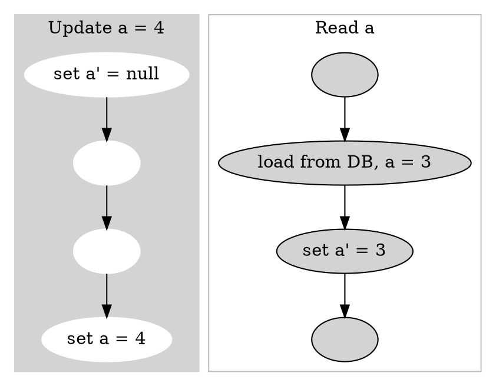
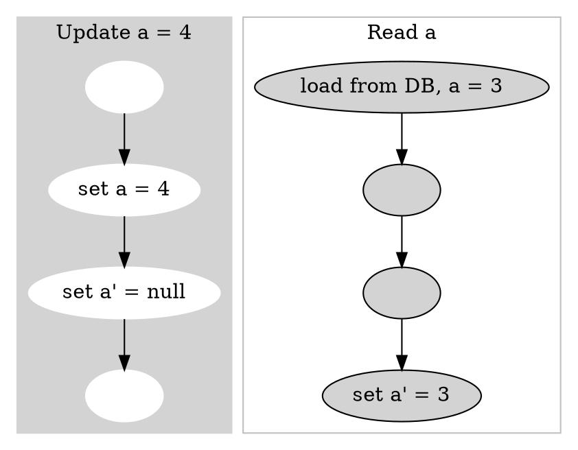
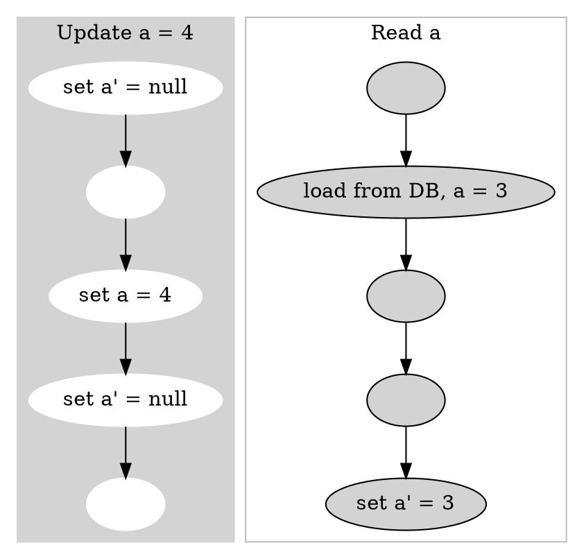

# 缓存与一致性
针对于以下缓存使用方式：
1. 查询时：先查缓存，若能查到，直接返回，若不能查到，查DB后设置缓存并返回
2. 修改时：删除缓存 + 写DB （但需考虑先后顺序）

## 先删缓存后改DB
假设a表示DB中的数据，a'表示缓存中的数据，初始情况下a = 3, a' = 3。同时遇到一个线程更新值为4和另一个线程读a的值时，可能出现以下情况：

最终a = 4, a' = 3，出现缓存DB不一致

## 先改DB再删缓存
假设a表示DB中的数据，a'表示缓存中的数据，在刚进行一次更新后a = 3, a' = null。同时遇到一个线程更新值为4和另一个线程读a的值时，可能出现以下情况：

## 缓存双删
即先删缓存，再改DB，再删缓存

最后还是出现了a = 4, a' = 3的不一致情况。

## 总结
在使用缓存后，由于读写均不是原子性（读包括读DB & Set缓存，写包括写DB & 删缓存），因此在并发情况下将会导致缓存与DB不致。
不管是先删缓存还是先改DB，都不能避免此问题(由于这个原因，即使是通过消费binlog来修改缓存也不能百分之百地保证缓存一致性)。
其解决办法可以是使用读写互斥锁来解决，读写互斥，写与写不互斥，读与读也不互斥（这样的锁有点奇怪，**可以考虑下怎么实现**，或者简单使用读写锁）

## 解决方案
### 延时双删
在"缓存双删"策略的基础上，最后一次删除缓存前Sleep一段时间（几乎可以保证读操作执行完成）。由于缓存适用于读多写少，因此在写时多耗一些时间也能接受。
此方案可以做到最终一致性，Sleep期间还是可能存在不一致性。